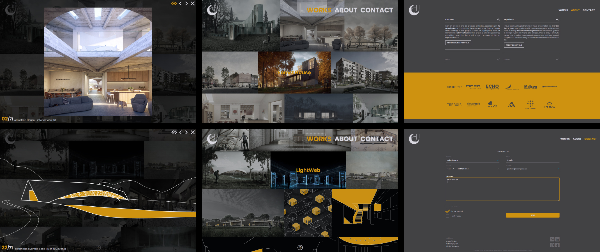

# My personal archviz portfolio website

This project balances the use of high-quality images with page load performance by implementing SVG placeholders for each image. Raster images are loaded progressively based on their visibility on the screen, utilizing lazy loading. The project is built primarily with custom functions, with few exceptions. All visualizations on the site were created by me when I used to work as an architectural visualizer.

## Main features:

- custom responsive grid of images written in JS. Each row's height depends on an aspect ratios of the images on the same row
- SVG placeholders for loading visualizations
- custom lazy loading for grid images and gallery pictures
- responsive carousel of images with two display modes

## Tech stack:

- HTML5, CSS3, SCSS, Vanilla JS, vite.js

[Live Demo](https://jakubchojna.pl/)

